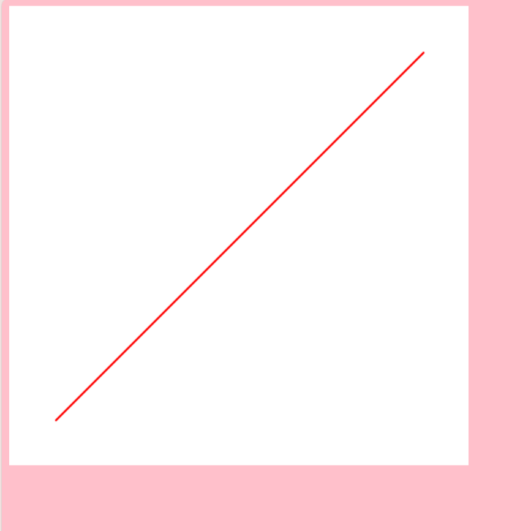

<!DOCTYPE html>
<html>
<head>
    <title>Portofolio Anissa Vika Anandari</title>
</head>
<body>

    <header style="background-color: pink; color: white; text-align: center; padding: 15px;">
        <h1>Portofolio Anissa Vika Anandari</h1>
    </header>

    <nav style="background: #333; text-align: center; padding: 10px;">
        <a href="index.html" style="color: white; text-decoration: none; padding: 10px 20px;">Beranda</a>
        <a href="profil.html" style="color: white; text-decoration: none; padding: 10px 20px;">Profil</a>
        <a href="tentang.html" style="color: white; text-decoration: none; padding: 10px 20px;">Tentang</a>
    </nav>

    <section style="margin: 20px auto; padding: 20px; border: 1px solid #ccc; width: 80%; text-align: center;">
        <h2>Selamat Datang!</h2>
        
Website ini berisi tugas-tugas grafika komputer

     	
	

            <h4>Tugas 1: Tokoh Grafika Komputer</h4>
            
            
<a href="tokoh.pdf" style="text-decoration: none; background: #ddd; padding: 5px; border-radius: 5px; display: inline-block;">Laporan</a>

            
<a href="https://youtu.be/sYdIRuUfiQE.com" style="text-decoration: none; background: #ddd; padding: 5px; border-radius: 5px; display: inline-block;">Video</a>

        

        

            <h4>Tugas 2: Algoritma Pembentukan Garis</h4>
            
            
<a href="garisDDA.html" style="text-decoration: none; background: #ddd; padding: 5px; border-radius: 5px; display: inline-block;">Hasil</a>

            
<a href="garis.pdf" style="text-decoration: none; background: #ddd; padding: 5px; border-radius: 5px; display: inline-block;">Laporan</a>

            
<a href="https://youtu.be/ikyS6RBk2xs.com" style="text-decoration: none; background: #ddd; padding: 5px; border-radius: 5px; display: inline-block;">Video</a>

        

        

            <h4>Tugas 3: Algoritma Pembentukan Lingkaran</h4>
            
            
<a href=".html" style="text-decoration: none; background: #ddd; padding: 5px; border-radius: 5px; display: inline-block;">Hasil</a>

            
<a href=".pdf" style="text-decoration: none; background: #ddd; padding: 5px; border-radius: 5px; display: inline-block;">Laporan</a>

            
<a href="https://youtu.be/" style="text-decoration: none; background: #ddd; padding: 5px; border-radius: 5px; display: inline-block;">Video</a>

        

    </section>

    <footer style="background: #333; color: white; text-align: center; padding: 10px; position: fixed; bottom: 0; width: 100%;">
        Hak Cipta &copy; 2025 Anissa Vika Anandari
    </footer>

</body>
</html>
